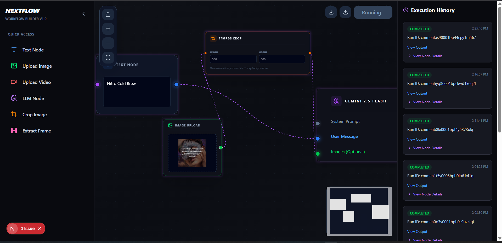
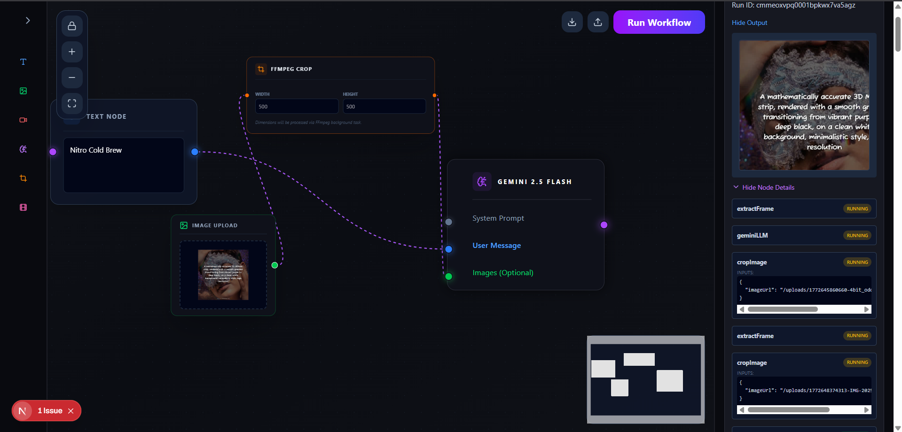

# NextFlow — AI Workflow Builder

A visual AI workflow builder inspired by [Krea.ai](https://krea.ai). Built with Next.js, React Flow, Trigger.dev, and Google Gemini 2.5 Flash.




## 🚀 Features

- **Visual Workflow Canvas** — Drag-and-drop node-based workflow builder using React Flow
- **Clerk Authentication** — Secure sign-in/sign-up with protected routes
- **Gemini 2.5 Flash LLM Node** — Send text prompts and images to Google Gemini
- **Image Upload Node** — Upload images directly into the workflow (stored in `public/uploads`)
- **Video Upload Node** — Upload videos for frame extraction
- **Crop Image Node** — Crop uploaded images via FFmpeg background tasks
- **Extract Frame Node** — Extract frames from videos using FFmpeg
- **Execution History Sidebar** — View past runs with status, output, and node-level details
- **Export/Import Workflow** — Save and load workflows as JSON
- **Pulsating Glow on Running Nodes** — Visual feedback during execution

## 🛠 Tech Stack

| Layer | Technology |
|---|---|
| Framework | Next.js 15 (App Router) |
| Auth | Clerk |
| Canvas | React Flow |
| AI | Google Gemini 2.5 Flash |
| Background Jobs | Trigger.dev v3 |
| Database | Neon PostgreSQL + Prisma |
| Media Processing | FFmpeg (fluent-ffmpeg) |
| Styling | Tailwind CSS |
| State Management | Zustand |
| File Storage | Local (`public/uploads`) — gitignored |

## ⚙️ Getting Started

### 1. Clone the repo
```bash
git clone https://github.com/ak-jaat-007/Nextflow-AI-Workflow_builder.git
cd Nextflow-AI-Workflow_builder
```

### 2. Install dependencies
```bash
npm install
```

### 3. Set up environment variables

Create a `.env.local` file in the root:
```env
DATABASE_URL=your_neon_postgresql_url

NEXT_PUBLIC_CLERK_PUBLISHABLE_KEY=your_clerk_publishable_key
CLERK_SECRET_KEY=your_clerk_secret_key
NEXT_PUBLIC_CLERK_SIGN_IN_URL=/sign-in
NEXT_PUBLIC_CLERK_SIGN_UP_URL=/sign-up
NEXT_PUBLIC_CLERK_AFTER_SIGN_IN_URL=/
NEXT_PUBLIC_CLERK_AFTER_SIGN_UP_URL=/

GEMINI_API_KEY=your_gemini_api_key
TRIGGER_SECRET_KEY=your_trigger_dev_secret_key
NEXT_PUBLIC_BASE_URL=http://localhost:3000
```

### 4. Run database migrations
```bash
npx prisma migrate dev
```

### 5. Start the Trigger.dev worker (separate terminal)
```bash
npx trigger.dev@latest dev
```

### 6. Start the dev server
```bash
npm run dev
```

Open [http://localhost:3000](http://localhost:3000)

## 🧩 Workflow Nodes

| Node | Description |
|---|---|
| Text Node | Input text for system prompt or user message |
| Image Upload | Upload an image into the workflow |
| Video Upload | Upload a video for processing |
| Crop Image | Crop an image using FFmpeg |
| Extract Frame | Extract a frame from a video |
| Gemini LLM | Send prompts + images to Gemini 2.5 Flash |

## 📁 Project Structure
```
src/
├── app/
│   ├── api/          # API routes (upload, history, run-workflow, runs)
│   ├── sign-in/      # Clerk sign-in page
│   └── sign-up/      # Clerk sign-up page
├── components/
│   ├── canvas/       # React Flow canvas
│   ├── nodes/        # Individual node components
│   └── sidebar/      # History and navigation sidebar
├── store/            # Zustand workflow state
├── trigger/          # Trigger.dev background tasks
└── lib/              # Prisma client, utilities
```

## 🌐 Deployment

1. Push your code to GitHub
2. Import the project into [Vercel](https://vercel.com)
3. Add all environment variables from `.env.local`
4. Deploy — your app will be live

> Make sure your Neon database is accessible from Vercel's network.

## 🔐 Environment Variables

All sensitive keys are stored in `.env.local` and never committed to git.

## 📄 License

MIT